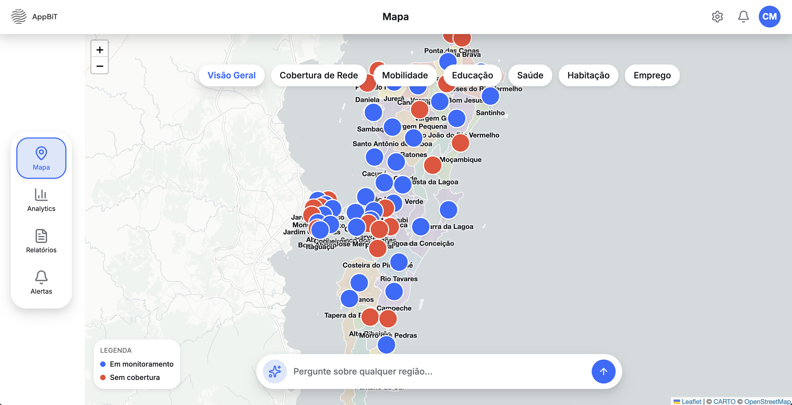
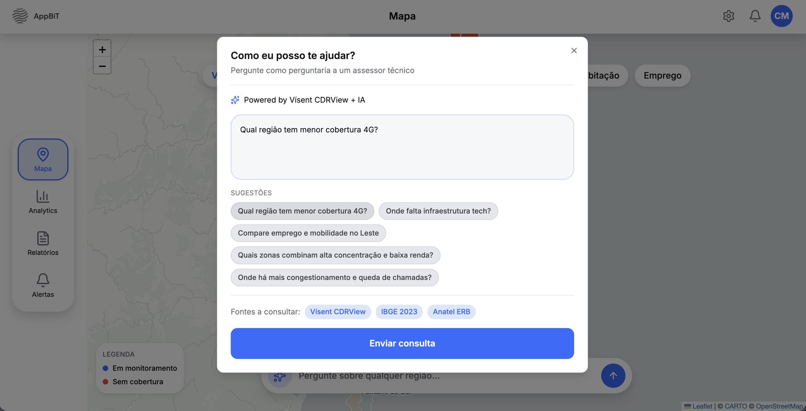

# App BiT — B2G | Equipo 17
## Painel de Dados Públicos com IA

> Hackathon App BiT — Wongola / Black in Tech  
> Desafío: B2G — Painel de Dados Públicos  
> Demo Day: 10/07/2026

---

## 🧩 O problema que resolvemos

Gestores públicos não têm acesso fácil a dados cruzados por região para basear políticas de inclusão social em evidências reais.

Nossa solução é uma Web App responsiva (PWA) com agente de IA que responde consultas em linguagem natural sobre o dataset **Vísent CDRView** (Grande Florianópolis): **concentração de pessoas × qualidade de rede × faixa de renda** por zona, mais **fluxos de mobilidade** origem→destino — tudo dado real, com resposta em formato de "paper" (afirmação + evidências + fontes + nível de confiança).

---
## 🌐 Acesso à aplicação

A aplicação está disponível em:

### Frontend
[https://appbit-web.onrender.com/](https://appbit-web.onrender.com/)  

### Backend
[https://appbit-api.onrender.com/](https://appbit-api.onrender.com/)

## 📱 Demo PWA


*Demonstração da aplicação rodando como PWA no celular*

## 🖥️ Screenshots


*Onboarding — apresentação da plataforma*


*Home — mapa temático da Grande Florianópolis*


*Agente de IA — consulta em linguagem natural com resposta em formato de paper*

## 🛠️ Stack

| Camada | Tecnologias |
|---|---|
| Backend | Python 3.12 · **FastAPI** + Pydantic · pandas (agregação em memória) · **Google Gemini** (`google-genai`, `gemini-3.5-flash`) · uvicorn |
| Frontend | **React 19** + Vite 8 + TypeScript · Tailwind v4 · Leaflet/react-leaflet (mapa temático) · react-i18next (**pt-BR/en/es**) · PWA (`vite-plugin-pwa`) · `@react-pdf/renderer` (export) |
| Qualidade | Ruff + pytest (CI GitHub Actions) · ESLint + `tsc -b` |
| Deploy | Render (2 serviços via `render.yaml`: API + site estático) |

Detalhes e decisões: [`skills/backend.md`](./skills/backend.md) · [`skills/frontend.md`](./skills/frontend.md) · [`docs/decisoes-tecnicas.md`](./docs/decisoes-tecnicas.md)

---

## 🚀 Como rodar o projeto localmente

### Pré-requisitos
- Node.js 20.19+ (ou 22.12+) — exigido pelo Vite 8
- Python 3.12+
- Git

### Backend (FastAPI)
```bash
cd backend
python3 -m venv .venv
source .venv/bin/activate
pip install -r requirements.txt -r requirements-dev.txt
cp .env.example .env           # opcional — sem AI_API_KEY a IA responde com confiança baixa (sem 500)
python -m scripts.ingest       # opcional — pipeline ETL: valida e gera dataset/processed/concentracao.parquet
uvicorn app.main:app --reload  # http://localhost:8000/docs (Swagger)
```

### Frontend (React + Vite)
```bash
cd frontend
npm install
npm run dev                    # http://localhost:5173
```

---

## ⚙️ Variáveis de ambiente

Backend (`backend/.env`, baseado no `backend/.env.example`):

```
AI_API_KEY=sua_chave_do_gemini   # NUNCA commitar; em prod vai no painel do Render
AI_MODEL=gemini-3.5-flash
FRONTEND_ORIGIN=http://localhost:5173   # CORS
```

Frontend (`frontend/.env`):

```
VITE_API_URL=http://localhost:8000   # host puro, sem /api/v1
```

⚠️ O Vite embute o env no **build** — mudou `VITE_API_URL`, tem que rebuildar.

---

## 📡 Endpoints (tudo sob `/api/v1`)

| Método | Endpoint | Descrição |
|--------|----------|-----------|
| GET | `/api/v1/health` | Status da API (health check do Render) |
| POST | `/api/v1/dados` | Consulta ao agente de IA em linguagem natural → "paper" |
| GET | `/api/v1/mapa` | Pins de concentração por zona (mantido pelo contrato) |
| GET | `/api/v1/mapa/rede` | Qualidade de rede por zona (congestionamento; `sem_dados`) |
| GET | `/api/v1/mapa/mobilidade` | Fluxos origem→destino (`?regiao=` filtra; sem filtro = 80 maiores) |
| GET | `/api/v1/mapa/overview` | 56 bairros de Floripa × status de monitoramento |

Contrato completo: [`docs/contrato-integracao.md`](./docs/contrato-integracao.md) · Swagger em `/docs`

### Exemplo de uso

```bash
POST /api/v1/dados
{
  "consulta": "Onde há mais congestionamento e queda de chamadas?",
  "idioma": "pt",
  "filtros": { "regiao": "São José" }   # opcional — município ou zona da Grande Floripa
}
```

---

## 📊 Dataset Vísent CDRView

Grande Florianópolis: **132 ERBs reais** (coordenadas Anatel), 27 zonas (clusters), 7 municípios, 15 dias. Dados sintéticos sobre antenas reais.

- Indicadores: concentração de pessoas (`n_usuarios`), qualidade de rede (proxies `congestionamento_medio`/`drop_pct_medio`), faixa de renda (`income_cluster`) e fluxos origem→destino.
- Os CSVs agregados (~3 MB) ficam **commitados em `backend/dataset/`**; os tensores de GB são proibidos no repo (`.gitignore`).
- **Pipeline de ingestão** (`python -m scripts.ingest`, de `backend/`): Extract → Profiling → Transform → Validate → Load — valida os dados e materializa `backend/dataset/processed/concentracao.parquet` (~9 kB, commitado). O backend **prefere o Parquet no startup** e cai pros CSVs se ele não existir. Detalhes: [`docs/pipeline-dados.md`](./docs/pipeline-dados.md)
- Dicionário de colunas completo: [`docs/dados-visent.md`](./docs/dados-visent.md)

Fonte: [github.com/wongola-bit/appbit](https://github.com/wongola-bit/appbit) (pasta `dataset-visent/`)

---

## 🏗️ Arquitetura

```
[PWA React] → [API FastAPI /api/v1] → [data service (pandas)] ┐
                                      [ai service (prompt)] → [Gemini]
```

O agente de IA recebe os dados **agregados e rotulados** no prompt e responde ancorado neles (não inventa números). Detalhes em [`docs/arquitetura.md`](./docs/arquitetura.md) e [`docs/agente-ia.md`](./docs/agente-ia.md).

---

## 🚢 Deploy (Render)

Dois serviços definidos em [`render.yaml`](./render.yaml):

| Serviço | Tipo | Config |
|---|---|---|
| Backend | Web Service | root `backend` · `uvicorn app.main:app --host 0.0.0.0 --port $PORT` · health `/api/v1/health` |
| Frontend | Static Site | root `frontend` · build `npm install && npm run build` · publish `dist` |

Guia completo: [`docs/deploy.md`](./docs/deploy.md)

---

## 👥 Equipe

| Nome | Perfil | GitHub |
|------|--------|--------|
| Leonardo Behnck | Mobile Developer | [@leonardobehnck](https://github.com/leonardobehnck) |
| Noelia Daiana Limp Arriola | UX/UI Designer | [@noeliaarriola](https://github.com/noeliaarriola) |
| Thayssa Neves | Backend Developer | [@RodaThay](https://github.com/RodaThay) |

---

## 📋 Estado do MVP

- [x] API em camadas (FastAPI) com dado real do Vísent + agente Gemini ancorado
- [x] Pipeline de ingestão do Vísent funcional (`python -m scripts.ingest` → Parquet validado, carregado no startup)
- [x] Endpoints no ar: `/health` · `/dados` · `/mapa` + `rede`/`mobilidade`/`overview`
- [x] Mapa temático de Floripa com 3 camadas reais (visão geral, rede, mobilidade — fetch lazy por filtro)
- [x] Fluxo de consulta à IA em modal (pergunta → paper → export **PDF**)
- [x] i18n em 3 idiomas (pt-BR/en/es) + PWA instalável
- [x] CI (Ruff + pytest) e deploy configurado no Render
- [x] Plugar `AI_API_KEY` de produção e validar ao vivo
- [ ] Página de alertas (placeholder) · dashboards Analytics/Reports com dado real

---

## 🔗 Links úteis

- Design system: [Figma](https://www.figma.com/design/nohbwrvbhVZ1vfOtT3wWwJ/App-Bit---Hackathon?node-id=13-10&t=RSNyky9I48PDEyN7-1)
- Discord do hackathon: [discord.gg/7gBYpXCh3j](https://discord.gg/7gBYpXCh3j)
- Brief completo: [github.com/wongola-bit/appbit-hackathon](https://github.com/wongola-bit/appbit-hackathon)
- Dataset Vísent: [github.com/wongola-bit/appbit](https://github.com/wongola-bit/appbit)
